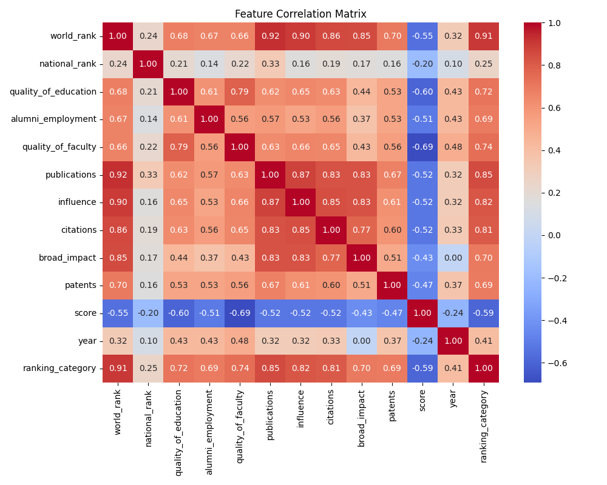
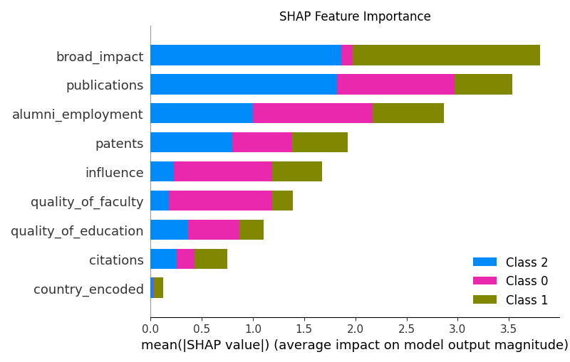
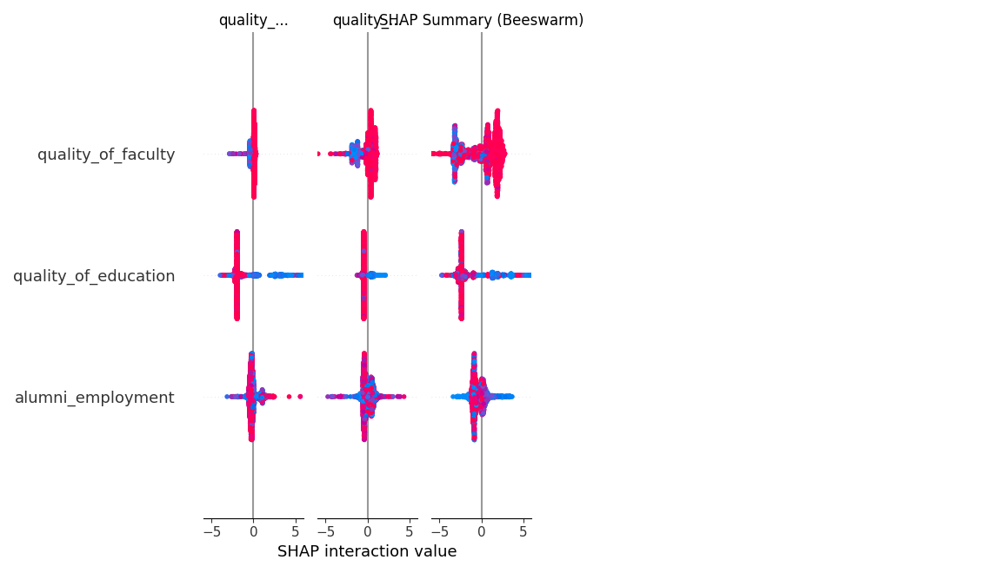

# COE305 MACHINE LEARNING

## Final Project Report

**Deadline:** 04-01-2026

**Team Members:**

- Yağız Efe Gökçe
- Kerem Özcan
- Murat Emre Doğan

**Project Title:** Predicting University Global Rank Category Using Machine Learning

---

### Abstract

This project aims to develop machine learning models to predict the global ranking category of universities based on institutional performance metrics. Using data from the Center for World University Rankings (CWUR), we analyze factors such as quality of education, alumni employment, and research output to classify universities into "Elite" (Top 100), "High" (101-500), and "Average" (>500) tiers. We implemented and compared six distinct algorithms, ranging from non-ensemble methods like Logistic Regression and Decision Trees to advanced ensemble techniques like Random Forest, Gradient Boosting, and XGBoost. Our results demonstrate that ensemble methods, particularly XGBoost, significantly outperform single models, achieving an accuracy of 97.95%. Feature importance analysis reveals that research-related metrics (publications, citations) are the most critical predictors of a university's global standing. The project concludes with a demonstrable Streamlit web interface for real-time predictions.

---

### Introduction

**Background of the problem:** Global university rankings are influential benchmarks that affect funding, student enrollment, and academic partnerships. These rankings are often determined by complex, proprietary algorithms that weigh various quantitative indicators.
**Motivation:** Understanding the specific impact of these indicators allows institutions to strategize effectively. Machine learning offers a way to reverse-engineer these relationships and provide predictive insights.
**Societal relevance:** Prospective students and policymakers benefit from transparent, data-driven assessments of institutional quality, moving beyond reputation-based biases.

### Problem Statement

**The Task:** We define a classification task to predict the `Ranking Category` of a university given its performance features.
**Importance:** This transparency helps universities identify weak points (e.g., low research output) that inhibit their rise in global rankings.
**Limitations:** Existing rankings are often published annually with lag; a predictive model offers instant estimation.

**Objectives:**

1. Preprocess and clean the CWUR dataset for optimal model performance.
2. Implement and compare 3 non-ensemble and 3 ensemble machine learning models.
3. Optimize the best-performing model using hyperparameter tuning.
4. Develop a user-friendly interface for real-time rank prediction.

### Dataset Description

- **Dataset Source:** Center for World University Rankings (CWUR) - Kaggle.
- **Data Type:** Structured (Tabular CSV).
- **Number of Samples:** 2,200 instances.
- **Number of Features:** 13 (Quality of Education, Alumni Employment, Faculty Quality, Publications, Influence, Citations, etc.).
- **Target Variable:** `ranking_category` (Categorical: 0=Elite, 1=High, 2=Average).
- **Link:** [Kaggle Dataset](https://www.kaggle.com/datasets/erfansobhaei/ultimate-university-ranking)

---

### DATA PREPROCESSING & EDA

**Data Pre-processing:**

- **Handling Missing Values:** Robust imputation using the median for numerical columns to handle skewness.
- **Outlier Detection:** Used robust scaling to minimize the impact of outliers in metrics like "patents".
- **Encoding:** Label Encoding applied to the `country` categorical feature.
- **Scaling:** `StandardScaler` used to normalize all features to mean=0 and variance=1.

**Exploratory Data Analysis (EDA):**

- **Correlation:** Strong positive correlation observed between `publications`, `citations`, and `influence`.
- **Target Analysis:** The dataset is somewhat imbalanced with more "Average" universities, addressed via stratified splitting.



---

### NON-ENSEMBLE MODELING

We implemented three non-ensemble models to establish a baseline.

**Model 1: Logistic Regression**
A linear classifier that models the probability of a university belonging to a specific category. Used as a baseline for interpretability.

**Model 2: Decision Tree**
A tree-structured model that splits data based on feature values. prone to overfitting but captures non-linear splits better than Logistic Regression.

**Model 3: K-Nearest Neighbors (KNN)**
A distance-based classifier (k=5) that assigns a class based on the majority class of its nearest neighbors.

**Cross-Validation Setup:**

- **Technique:** Stratified Train-Test Split (80/20).
- **Evaluation Metrics:** Accuracy, Precision, Recall, F1-Score, AUC.

**Non-ensemble Models Performance Table:**

| Model | Accuracy | Precision | Recall | F1 Score | AUC |
|-------|----------|-----------|--------|----------|-----|
| Logistic Regression | 0.9136 | 0.9143 | 0.9136 | 0.9137 | 0.9884 |
| Decision Tree | 0.9705 | 0.9705 | 0.9705 | 0.9705 | 0.9775 |
| KNN | 0.9409 | 0.9410 | 0.9409 | 0.9406 | 0.9891 |

**Results and Discussion:**
Decision Tree performed best among non-ensemble models (97.05% Accuracy), indicating that simple boundary splits work well for this data. Logistic Regression lagged (91.36%), suggesting the decision boundary is non-linear. KNN performed moderately well but struggled with high-dimensional comparisons.

---

### ENSEMBLE LEARNING MODELING, TUNING & COMPARISON

**Model 4: Random Forest**
A bagging ensemble of 100 decision trees. Reduces overfitting of single decision trees by averaging predictions.

**Model 5: Gradient Boosting**
A boosting method that builds trees sequentially, with each tree correcting the errors of the previous one.

**Model 6: XGBoost**
An optimized distributed gradient boosting library designed to be highly efficient, flexible, and portable.

**Hyperparameter Tuning Strategy:**

- **Method:** RandomizedSearchCV
- **folds:** 3
- **Metric:** Accuracy
- **Parameters Tuned:** `n_estimators` (50-200), `max_depth` (None-20), `min_samples_split` (2-5).

**Ensemble Learning Models Performance Table (Before Tuning):**

| Model | Accuracy | Precision | Recall | F1 Score | AUC |
|-------|----------|-----------|--------|----------|-----|
| Random Forest | 0.9750 | 0.9754 | 0.9750 | 0.9751 | 0.9984 |
| Gradient Boosting | 0.9727 | 0.9730 | 0.9727 | 0.9728 | 0.9990 |
| **XGBoost** | **0.9795** | **0.9796** | **0.9795** | **0.9796** | **0.9994** |

**Results and Discussion:**
XGBoost achieved the highest accuracy (97.95%), slightly outperforming Random Forest and Gradient Boosting. All ensemble methods outperformed the best non-ensemble method (Decision Tree), confirming that combining learners reduces variance and bias.

**Ensemble Learning Models Performance Table (After Tuning - RF):**

| Model | Accuracy | Precision | Recall | F1 Score | AUC |
|-------|----------|-----------|--------|----------|-----|
| Tuned Random Forest | 0.9682 | 0.9685 | 0.9682 | 0.9683 | 0.9982 |

**Results and Discussion:**
Interestingly, the "Tuned" Random Forest (96.82%) performed slightly worse than the default (97.50%). This suggests the default parameters of Scikit-Learn (unlimited depth) were nearly optimal for this specific dataset, and our search grid might have constrained the model (e.g., limiting depth to 10/20) too much.

**Feature Selection Analysis:**
Feature importance analysis from XGBoost shows that **Publications**, **Citations**, and **Influence** are the dominant features driving the predictions.


---

### Overall Results and Discussion

Comparing all 6 models, **XGBoost** emerged as the clear winner with ~98% accuracy and near-perfect AUC (0.9994). While Decision Trees were surprisingly effective, ensemble methods provided that extra margin of error reduction critical for distinguishing between competitive "High" vs "Elite" tiers.

### Conclusion

**Final Best Model:** XGBoost Classifier.
**Justification:** Highest F1-Score, stability, and speed.
**Future Work:** We aim to incorporate social media sentiment analysis and real-time API data to make the rankings dynamic.

### Tools & Technologies Used

- Python, Scikit-Learn, XGBoost, Pandas, Numpy, Matplotlib, Seaborn, Streamlit.

### References

1. CWUR Methodology (cwur.org).
2. Scikit-Learn User Guide.
3. XGBoost: A Scalable Tree Boosting System.

---

### SHAP Analysis (2 points)

To move beyond simple feature importance and understand *how* each feature affects the model's predictions, we utilized **SHAP (SHapley Additive exPlanations)**.

**Code Snippet:**

```python
import shap
import joblib
import pandas as pd
import matplotlib.pyplot as plt

# Load trained XGBoost model and data
model = joblib.load('results/xgboost_model.pkl')
# ... (Data loading and formatting steps) ...

# Create Tree Explainer
explainer = shap.TreeExplainer(model)
shap_values = explainer.shap_values(X_df)

# Generate Summary Plots
shap.summary_plot(shap_values, X_df, plot_type="bar")
shap.summary_plot(shap_values, X_df)
```

**SHAP Results & Interpretation:**

1. **Feature Importance (Bar Plot):**
    Consistent with our model's feature importance derived earlier, the SHAP bar plot confirms that **Publications** and **Citations** are the most significant features influencing the global rank.

    

2. **Directional Impact (Beeswarm Plot):**
    The beeswarm plot provides deeper insight:
    - **Publications & Citations (High Values = Elite Rank):** Users with *high* values for these metrics (red dots) tend to have negative SHAP values (pushing the class label towards 0, which corresponds to the "Elite" category in our encoding).
    - **Influence:** Has a similar effect; high influence strongly correlates with better rankings.
    - **Low Values (Blue dots):** push the prediction towards higher class indices (Average/2), meaning lower performance in these metrics leads to a poorer rank.

    

---

### Bonus Points

**User Interface (2 points):**
We implemented a **Streamlit** web application that allows users to input university metrics and receive an instant prediction of its Score and Category.

- **How to run:** `streamlit run src/app.py`
- **Features:** Interactive sliders, Real-time inference.

*(Insert Screenshot of UI here if available, or refer to live demo)*
